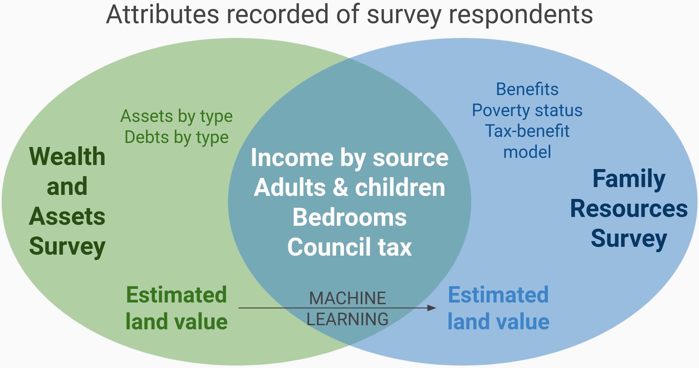

## Imputing land value to the FRS

[**`frs_was_imputation.py`**](https://github.com/PolicyEngine/openfisca-uk-data/blob/master/openfisca_uk_data/datasets/frs/frs_was_imputation.py)

No UK dataset directly estimates land value alongside income, but we connected multiple government sources to estimate it:

* [**2019 National Balance Sheet estimates (NBS)**](https://www.ons.gov.uk/economy/nationalaccounts/uksectoraccounts/datasets/thenationalbalancesheetestimates) contains land value by sector (Table C, column W).
* [**2016-2018 Wealth and Assets Survey (WAS)**](https://www.ons.gov.uk/peoplepopulationandcommunity/personalandhouseholdfinances/debt/methodologies/wealthandassetssurveyqmi) contains income, demographics, and wealth by asset type (but not land value).
* [**2019-2020 Family Resources Survey (FRS)**](https://www.gov.uk/government/statistics/family-resources-survey-financial-year-2019-to-2020) contains income, benefits, and demographics (but not wealth); it is the core dataset for most distributional analysis.

We started by combining the NBS summary with the WAS to estimate land value for each household in the WAS.
Of the £5.7 trillion in total land value, the NBS reports that £3.9 trillion is held by households, £1.6 trillion is held by corporations, and the remaining £200 billion is held by governments.

The WAS, meanwhile, sums to £6.2 trillion in property wealth and £4.9 trillion in corporate wealth.
Dividing the respective values shows that households have 62p of land for each £1 in property wealth, and 33p of land for each £1 in corporate wealth.
We estimate the land value of each household using these factors, producing land value that sums to the £5.5 trillion in non-government land wealth.

<table>
  <tr>
   <td><strong>Household</strong>
   </td>
   <td><strong>Property wealth</strong>
   </td>
   <td><strong>Corporate wealth</strong>
   </td>
   <td><strong>Estimated land value</strong>
   </td>
  </tr>
  <tr>
   <td>1
   </td>
   <td>£x
   </td>
   <td>£y
   </td>
   <td>0.62x + 0.33y
   </td>
  </tr>
  <tr>
   <td>...
   </td>
   <td>...
   </td>
   <td>...
   </td>
   <td>...
   </td>
  </tr>
  <tr>
   <td><strong>Total</strong>
   </td>
   <td><strong>£6.2tn</strong>
   </td>
   <td><strong>£4.9tn</strong>
   </td>
   <td><strong>£5.5tn</strong>
   </td>
  </tr>
</table>

Given the estimated land value for each household in the WAS, our next task was to map it to households in the FRS, the core dataset for our analysis.
We applied our [synthimpute](https://github.com/PSLmodels/synthimpute/) Python package, which imputes data from one source to another using skewed random forests quantile regression.
Specifically, we built a nonparametric prediction model from the WAS of land value, based on several household characteristics common to the WAS and FRS[^predictors], then used that model to sample from each FRS household's predicted distribution.
To ensure that the total in the FRS matched the £5.5 trillion in land value, we introduced bias to sample from the predicted distribution using the Beta distribution.

[^predictors]:  Our model of WAS land value used the following predictors: gross income, number of adults, number of children, pension income, employment income, self employment income, investment income, number of bedrooms, council tax, and whether the household rents.

We're working on improvements to the land imputation:
* [Uprating WAS data](https://github.com/PolicyEngine/openfisca-uk-data/issues/34) to account for wealth growth from 2018 to 2020
* [Adding region to the WAS-FRS imputation](https://github.com/PolicyEngine/openfisca-uk-data/issues/21)
* [Reporting model quality](https://github.com/PolicyEngine/openfisca-uk-data/issues/22) by summarizing quantile loss on a holdout set
